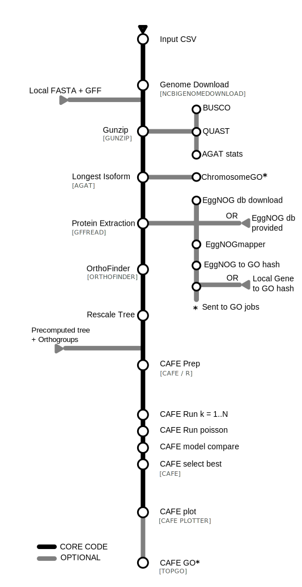

# EXCON (v2.2.0)

A Nextflow pipeline for gene family **EX**pansion and **CON**traction analysis 
across multiple species using CAFE5.

Given a set of genome assemblies and annotations, EXCON builds orthogroups with 
OrthoFinder, fits and compares multiple CAFE models to identify gene families 
evolving at significantly different rates, and automatically selects the 
best-fitting model for downstream analysis. Optionally, GO enrichment analysis 
can be run on expanded and contracted gene families, and on genes grouped by 
chromosome.

It works with any set of species that have a genome (fasta) and annotation (gff) file. 
(minimum of 5 species ideally up to around 30). Maximum 100 species (normally). 

## Overview

The general pipeline logic is as follows:



* Downloads genome and annotation files from NCBI `[NCBIGENOMEDOWNLOAD]`, or you provide your own.
* Unzips the files, if necessary `[GUNZIP]`
* Sanitises GFF annotations and extracts longest isoform `[AGAT_SPKEEPLONGESTISOFORM]`.
* Gets the protein sequences `[GFFREAD]`.
* Renames the genes to gene name (as some will be isoform name) `RENAME_FASTA`.
* Finds orthologous genes across species `[ORTHOFINDER_CAFE]`, or accepts a pre-computed tree and orthogroups to skip this step (see `--input_tree` / `--input_orthogroups`).
* Rescales OrthoFinder branch lengths and converts to an ultrametric tree for CAFE `[RESCALE_TREE]`, `[CAFE_PREP]`.
* Prepares gene count input, estimates the error model, and builds an ultrametric tree `[CAFE_PREP]`.
* Runs CAFE5 with k=1 to k=`cafe_max_k` (default 6) rate categories in parallel `[CAFE_RUN_K]`.
* Compares all k runs by AIC and selects the best k `[CAFE_SELECT_K]`.
* Re-runs CAFE5 at the best k with Poisson birth-death (`-p`) `[CAFE_RUN_BEST]`.
* Compares uniform vs Poisson model at the best k by likelihood, selects the winner `[CAFE_MODEL_COMPARE]`.
* Plots gene family expansions and contractions for the best model `[CAFE_PLOT]`.

### Optional — GO enrichment (`--run_eggnog` or `--predownloaded_gofiles`)

* GO annotation can be run in two ways:
- **Run EggNOG-mapper** (`--run_eggnog`): assigns GO terms from scratch using the EggNOG database (~45 GB). 
  Provide `--eggnog_data_dir` to reuse a pre-downloaded copy and avoid re-downloading on every run.
- **Supply your own GO files** (`--predownloaded_gofiles`): if you already have gene-to-GO mappings, 
  point to a directory of `{species_id}.go.txt` files and skip EggNOG entirely (see [Parameters](#go-annotation-optional) below).
* Optionally downloads the EggNOG-mapper database `[EGGNOG_DOWNLOAD]`. Default is on, unless you provide it.
* Optionally assigns GO terms to genes using EggNOG-mapper `[EGGNOGMAPPER]`, or reads GO terms from user-supplied files.
* Optionally prepares GO gene lists from the best CAFE model results `[CAFE_GO_PREP]`.
* Optionally runs GO enrichment in parallel, one job per species/node 
  and direction (expansion/contraction) `[CAFE_GO_RUN]`.

### Optional — chromosome GO enrichment (`--chromo_go`, requires GO annotation)

* Optionally plots GO enrichment of genes by chromosome `[CHROMO_GO]`.
* Optionally summarizes GO enrichment by chromosome `[SUMMARIZE_CHROMO_GO]`.

### Optional — genome quality statistics (`--stats`)

* Optionally describes genome assembly and annotation:
  - `[BUSCO_BUSCO]`: Completeness of the genome compared to expected gene set.
  - `[QUAST]`: Assembly contiguity statistics (N50 etc).
  - `[AGAT_SPSTATISTICS]`: Gene, exon, and intron statistics.

## Installation

Nextflow pipelines require a few prerequisites. There is further documentation on the nf-core webpage [here](https://nf-co.re/docs/usage/installation), about how to install Nextflow.

### Prerequisites

- [Docker](https://docs.docker.com/engine/install/) or [Singularity](https://docs.sylabs.io/guides/3.11/admin-guide/installation.html).
- [Java](https://www.java.com/en/download/help/download_options.html) and [openJDK](https://openjdk.org/install/) >= 8 (**Please Note:** When installing Java versions are `1.VERSION` so `Java 8` is `Java 1.8`).
- [Nextflow](https://www.nextflow.io/docs/latest/getstarted.html) >= `v25.10.0`.
- When running nextflow with this pipeline, ideally run `NXF_VER=25.10.0` beforehand, to ensure functionality on this version.

### Install

To install the pipeline please use the following commands but replace VERSION with a [release](https://github.com/Eco-Flow/excon/releases).

`wget https://github.com/Eco-Flow/excon/archive/refs/tags/VERSION.tar.gz -O - | tar -xvf -`

or

`curl -L https://github.com/Eco-Flow/excon/archive/refs/tags/VERSION.tar.gz --output - | tar -xvf -`

This will produce a directory in the current directory called `excon-VERSION` which contains the pipeline.

## Inputs

### Required

* `--input /path/to/csv/file` - A singular csv file as input in one of the two formats stated below.

This csv can take 2 forms:
* A 2 field csv where each row is a unique species name followed by a Refseq genome reference ID (**NOT** a Genbank reference ID) i.e. `data/input_small-s3.csv`. The pipeline will download the relevant genome fasta file and annotation gff3 (or gff augustus) file.
* A 3 field csv where each row is a unique species name, followed by an absolute path to a genome fasta file, followed by an absolute path to an annotation gff3 (or gff augustus) file. Input can be gzipped (.gz) or not.

**Please Note:** The genome has to be chromosome level not contig level.

2 fields (Name,Refseq_ID):
```
Drosophila_yakuba,GCF_016746365.2
Drosophila_simulans,GCF_016746395.2
Drosophila_santomea,GCF_016746245.2
```

3 fields (Name,genome.fna,annotation.gff):
```
Drosophila_yakuba,data/Drosophila_yakuba/genome.fna.gz,data/Drosophila_yakuba/genomic.gff.gz
Drosophila_simulans,data/Drosophila_simulans/genome.fna.gz,data/Drosophila_simulans/genomic.gff.gz
Drosophila_santomea,data/Drosophila_santomea/genome.fna.gz,data/Drosophila_santomea/genomic.gff.gz
```

> **Note:** Genomes should be chromosome-level, not contig-level. RefSeq IDs must be used (not GenBank IDs).

## Parameters

### Core options

| Parameter | Description | Default |
|-----------|-------------|---------|
| `--input` | Path to input CSV file | Required unless using `--input_tree` + `--input_orthogroups` without `--run_eggnog` or `--stats` |
| `--outdir` | Output directory | `results` |
| `--groups` | NCBI taxonomy group for genome download (e.g. `insects`, `bacteria`) | `insects` |
| `--help` | Display help message | `false` |
| `--custom_config` | Path to a custom Nextflow config file | `null` |

### Quality statistics (optional)

| Parameter | Description | Default |
|-----------|-------------|---------|
| `--stats` | Run BUSCO, QUAST and AGAT statistics on genomes | `null` |
| `--busco_lineage` | BUSCO lineage database (e.g. `insecta_odb10`) | `null` |
| `--busco_mode` | BUSCO mode (`genome`, `proteins`, `transcriptome`) | `null` |
| `--busco_lineages_path` | Path to local BUSCO lineage databases | `null` |
| `--busco_config` | Path to BUSCO config file | `null` |

### OrthoFinder options (optional)

| Parameter | Description | Default |
|-----------|-------------|---------|
| `--orthofinder_v2` | Use OrthoFinder v2.5.5 instead of v3.1.4. v2 produces Hierarchical Orthogroups (`N0.tsv`) which have lower copy-number variance and are better suited to CAFE5. v3 produces flat orthogroups (`Orthogroups.tsv`). Recommended for large datasets (>30 species) or when CAFE5 fails to converge. | `false` |
| `--orthofinder_method` | Gene tree inference method: `msa` or `dendroblast` | `msa` |
| `--orthofinder_search` | Sequence search program: `diamond`, `blast`, or `mmseqs2` | `diamond` |
| `--orthofinder_msa_prog` | MSA program (requires `--orthofinder_method msa`): `mafft` or `muscle` | `mafft` |
| `--orthofinder_tree` | Tree inference method (requires `--orthofinder_method msa`): `fasttree`, `raxml`, `raxml-ng`, or `iqtree` | `fasttree` |

> **Note:** `-A` and `-T` are only valid when `-M msa` is set. If you set `--orthofinder_msa_prog` or `--orthofinder_tree` without `--orthofinder_method msa`, OrthoFinder will error.

### CAFE gene family evolution

| Parameter | Description | Default |
|-----------|-------------|---------|
| `--skip_cafe` | Skip CAFE analysis | `null` |
| `--cafe_max_k` | Maximum number of k rate categories to test (runs k=1 through k=N in parallel) | `6` |
| `--cafe_max_differential` | Maximum gene count differential for CAFE filtering on retry | `50` |
| `--tree_scale_factor` | Factor to multiply all OrthoFinder branch lengths by before `chronos()` converts the tree to a time tree for CAFE5. Lower values can cause numerical issues. | `1000` |
| `--input_tree` | Path to a pre-computed rooted species tree (Newick format) — skips OrthoFinder when used with `--input_orthogroups` | `null` |
| `--input_orthogroups` | Path to a pre-computed `Orthogroups.tsv` from a previous OrthoFinder run — skips OrthoFinder when used with `--input_tree` | `null` |

> **Skipping OrthoFinder:** OrthoFinder is the slowest step in the pipeline. If you have already run it
> (the results are in `results/orthofinder_cafe/ortho_cafe/`), you can reuse the outputs.
> The orthogroups file to pass depends on which version of OrthoFinder was used:
>
> **OrthoFinder v2 (`--orthofinder_v2`)** — use `N0.tsv` (Hierarchical Orthogroups):
> ```
> --input_tree results/orthofinder_cafe/ortho_cafe/Species_Tree/SpeciesTree_rooted_node_labels.txt \
> --input_orthogroups results/orthofinder_cafe/ortho_cafe/Phylogenetic_Hierarchical_Orthogroups/N0.tsv
> ```
>
> **OrthoFinder v3 (default)** — use `Orthogroups.tsv` (flat orthogroups):
> ```
> --input_tree results/orthofinder_cafe/ortho_cafe/Species_Tree/SpeciesTree_rooted_node_labels.txt \
> --input_orthogroups results/orthofinder_cafe/ortho_cafe/Orthogroups/Orthogroups.tsv
> ```
> Both `--input_tree` and `--input_orthogroups` must be supplied together. If either is omitted, OrthoFinder runs normally.

> **Note on CAFE model selection:** The pipeline runs CAFE5 with k=1 through k=`cafe_max_k` (default 6) 
> rate categories in parallel, then selects the best k by AIC. It then re-runs the best k with the 
> Poisson birth-death option (`-p`) and picks the final model by likelihood. Model selection results 
> (AIC table across k values) are in `results/cafe/model_comparison/`. If scores cannot be parsed 
> (e.g. on very small datasets), the pipeline defaults to the uniform model.

### GO annotation (optional)

GO enrichment requires gene-to-GO mappings. Choose one of the two approaches below — they are mutually exclusive, and `--run_eggnog` takes priority if both are set.

#### Option A — Run EggNOG-mapper

| Parameter | Description | Default |
|-----------|-------------|---------|
| `--run_eggnog` | Run EggNOG-mapper to assign GO terms | `false` |
| `--eggnog_data_dir` | Path to pre-downloaded EggNOG database directory | `null` (downloads ~45 GB automatically) |
| `--eggnog_target_taxa` | Restrict annotations to orthologs from this taxon and its descendants (NCBI taxon ID) | `null` |
| `--eggnog_tax_scope` | Taxonomic scope for orthologous group assignment (e.g. `50557` for Insecta) | `null` |
| `--eggnog_evalue` | Maximum e-value threshold for sequence matches | `null` |
| `--eggnog_score` | Minimum bitscore threshold for matches | `null` |
| `--eggnog_pident` | Minimum percent identity (%) | `null` |
| `--eggnog_query_cover` | Minimum query coverage (%) | `null` |
| `--eggnog_subject_cover` | Minimum subject coverage (%) | `null` |
| `--eggnog_rep_species` | Species to use as the representative for the OG annotation summary (must match a species name in the input CSV). Auto-selects the most-annotated species when unset. | `null` (auto) |

> **Note:** The EggNOG database is ~45 GB. We strongly recommend downloading it once and passing `--eggnog_data_dir /path/to/eggnog_data` to avoid re-downloading on every run.

#### Option B — Supply your own GO files

| Parameter | Description | Default |
|-----------|-------------|---------|
| `--predownloaded_gofiles` | Path to a directory of pre-computed gene-to-GO mapping files | `null` |

The directory must contain one file per species, named `{species_id}.go.txt` where `species_id` matches the species names in your input CSV. Each file is a two-column, tab-separated file with one gene–GO pair per line:

```
geneA    GO:0006412
geneA    GO:0008150
geneB    GO:0003674
```

This lets you skip EggNOG entirely if you already have GO annotations (e.g. from a previous run, a public database, or another annotation tool).

### GO enrichment analysis (optional, requires GO annotation)

| Parameter | Description | Default |
|-----------|-------------|---------|
| `--chromo_go` | Run GO enrichment analysis by chromosome | `null` |
| `--go_cutoff` | P-value cutoff for GO enrichment | `0.05` |
| `--go_type` | GO test type (e.g. `none`) | `none` |
| `--go_max_plot` | Maximum number of GO terms to plot | `10` |
| `--go_algo` | topGO algorithm and statistic (`classic_fisher`, `weight01_t`, `elim_ks`, `weight_ks`) | `classic_fisher` |

### Resource limits

| Parameter | Description | Default |
|-----------|-------------|---------|
| `--max_memory` | Maximum memory per job | `128.GB` |
| `--max_cpus` | Maximum CPUs per job | `16` |
| `--max_time` | Maximum runtime per job | `240.h` |

## Profiles

| Profile | Description |
|---------|-------------|
| `docker` | Run with Docker containers |
| `singularity` | Run with Singularity containers |
| `conda` | Run with Conda environments |
| `test_bacteria` | Test run with small bacterial genomes |
| `test_small` | Test run with small insect genomes |


## Profiles

This pipeline is designed to run in various modes that can be supplied as a comma separated list i.e. `-profile profile1,profile2`.

### Container Profiles

Please select one of the following profiles when running the pipeline.

* `docker` - This profile uses the container software Docker when running the pipeline. This container software requires root permissions so is used when running on cloud infrastructure or your local machine (depending on permissions). **Please Note:** You must have Docker installed to use this profile.
* `singularity` - This profile uses the container software Singularity when running the pipeline. This container software does not require root permissions so is used when running on on-premise HPCs or you local machine (depending on permissions). **Please Note:** You must have Singularity installed to use this profile.
* `apptainer` - This profile uses the container software Apptainer when running the pipeline. This container software does not require root permissions so is used when running on on-premise HPCs or you local machine (depending on permissions). **Please Note:** You must have Apptainer installed to use this profile.

### Optional Profiles

* `local` - This profile is used if you are running the pipeline on your local machine.
* `aws_batch` - This profile is used if you are running the pipeline on AWS utilising the AWS Batch functionality. **Please Note:** You must use the `Docker` profile with with AWS Batch.
* `test_small` - This profile is used if you want to test running the pipeline on your infrastructure, running from predownloaded go files. **Please Note:** You do not provide any input parameters if this profile is selected but you still provide a container profile.
* `test_biomart` - This profile is used if you want to test running the pipeline on your infrastructure, running from the biomart input. **Please Note:** You do not provide any input parameters if this profile is selected but you still provide a container profile.

## Custom Configuration

If you want to run this pipeline on your institute's on-premise HPC or specific cloud infrastructure then please contact us and we will help you build and test a custom config file. This config file will be published to our [configs repository](https://github.com/Eco-Flow/configs). 

## Running the Pipeline

**Please note:** The `-resume` flag uses previously cached successful runs of the pipeline.

1. Example run the full test example data:

```
NXF_VER=25.04.8 # Is latest it is tested on
nextflow run main.nf -resume -profile docker,test_small
```

*Settings in test_small:*
input = "input_small-s3.csv"

For the fastest run use: `nextflow run main.nf -resume -profile docker,test_bacteria`

2. To run on your own data (minimal run), cafe only. 

```
# NXF_VER=25.04.8  
nextflow run main.nf -resume -profile docker --input data/input_small-s3.csv
```

3. To run with cafe and GO analysis

```
# NXF_VER=25.04.8
nextflow run main.nf -resume -profile docker --input data/input_small-s3.csv --chromo_go --go_type bonferoni --stats --run_eggnog --eggnog_data_dir /path/to/eggnogdb 
```

4. To run with CAFE and GO analysis using your own pre-computed GO files (skips EggNOG):

```
# NXF_VER=25.04.8
nextflow run main.nf -resume -profile docker --input data/input_small-s3.csv --predownloaded_gofiles /path/to/go_files/
```

The `go_files/` directory should contain one `{species_id}.go.txt` per species (tab-separated `gene_id<TAB>GO:term`, one pair per line).

5. To reuse a previous OrthoFinder run (skips the slow OrthoFinder step). Or to use tree/table from another source use:

OrthoFinder v3 (default):
```
# NXF_VER=25.04.8
nextflow run main.nf -resume -profile docker \
  --input data/input_small-s3.csv \
  --input_tree results/orthofinder_cafe/ortho_cafe/Species_Tree/SpeciesTree_rooted_node_labels.txt \
  --input_orthogroups results/orthofinder_cafe/ortho_cafe/Orthogroups/Orthogroups.tsv
```

OrthoFinder v2 (`--orthofinder_v2`):
```
# NXF_VER=25.04.8
nextflow run main.nf -resume -profile docker \
  --input data/input_small-s3.csv \
  --input_tree results/orthofinder_cafe/ortho_cafe/Species_Tree/SpeciesTree_rooted_node_labels.txt \
  --input_orthogroups results/orthofinder_cafe/ortho_cafe/Phylogenetic_Hierarchical_Orthogroups/N0.tsv
```

## Output Structure

> For a detailed description of outputs with example figures, see the **[Output Guide](docs/outputs.md)**.
```
results/
├── cafe/
│   ├── base/                        # CAFE_PREP outputs
│   │   ├── hog_gene_counts.tsv      # Filtered gene count input to CAFE
│   │   ├── hog_filtering_report.tsv # Filtering report (only present if retry triggered)
│   │   └── SpeciesTree_rooted_ultra.txt  # Ultrametric tree used by CAFE5
│   ├── large_families/              # CAFE run on high-differential families (retry path only)
│   └── model_comparison/
│       ├── cafe_model_comparison.tsv # Uniform vs Poisson comparison at best k
│       └── best_model.txt            # "uniform" or "poisson"
├── cafe_plot/
│   └── cafe_plotter/                # Expansion/contraction plots for best model
├── cafe_go/                         # GO enrichment (one job per species/node x direction)
│   ├── CAFE_summary.txt             # Summary of expansions/contractions per branch
│   ├── *_TopGo_results_ALL.tab      # TopGO results per target
│   ├── TopGO_barplot_*.pdf          # Bar chart per target (ggplot2, full GO names)
│   ├── TopGO_dotplot_*.pdf          # Dot plot per target (fold enrichment x significance)
│   ├── TopGO_Pval_barplot_*.pdf     # Legacy barplots (base R)
│   ├── Go_summary_pos.pdf           # Summary plot across all expansions
│   ├── Go_summary_neg.pdf           # Summary plot across all contractions
│   ├── Go_summary_pos_noNode.pdf    # As above, terminal branches only
│   └── Go_summary_neg_noNode.pdf
├── chromo_go/                       # [optional] GO enrichment by chromosome
│   ├── *.pdf                        # Per-chromosome GO plots
│   └── summary/                     # Summarized results across chromosomes
├── eggnogmapper/
│   ├── *.emapper.annotations        # Raw EggNOG-mapper annotation files (one per species)
│   ├── OG_annotation_summary.tsv    # Per-orthogroup functional summary (description, COG, KEGG, PFAM)
│   └── go_files/                    # Per-species GO annotation files
├── gffread/
│   └── *.fasta                      # Protein sequences per species
├── ncbigenomedownload/
│   ├── *.fna.gz                     # Downloaded genome assemblies
│   └── *.gff.gz                     # Downloaded annotations
├── orthofinder_cafe/
│   └── ortho_cafe/                  # OrthoFinder results including species tree
├── busco/                           # [optional, --stats] BUSCO completeness results
├── agat/                            # [optional, --stats] AGAT annotation statistics
├── quast/                           # [optional, --stats] Assembly contiguity statistics
└── pipeline_info/
    ├── execution_report_*.html      # Nextflow execution report
    ├── execution_timeline_*.html    # Per-process timeline
    ├── execution_trace_*.txt        # Per-task resource usage
    ├── pipeline_dag_*.html          # Pipeline DAG diagram
    └── software_versions.yml        # Versions of all tools used
```


## Citation

This pipeline is published on Workflowhub using the nf-core template. If you use this pipeline in you work, the following citations are essential:

excon:
Wyatt, C. (2026). Gene EXpansion and CONtraction analysis pipeline. WorkflowHub. https://doi.org/10.48546/WORKFLOWHUB.WORKFLOW.2141.4

nf-core:
Philip Ewels, Alexander Peltzer, Sven Fillinger, Harshil Patel, Johannes Alneberg, Andreas Wilm, Maxime Ulysse Garcia, Paolo Di Tommaso & Sven Nahnsen.
Nat Biotechnol. 2020 Feb 13. doi: 10.1038/s41587-020-0439-x.

If you used any of these tools within the pipeline, you must also cite:

CAFE:
Fábio K Mendes, Dan Vanderpool, Ben Fulton, Matthew W Hahn, CAFE 5 models variation in evolutionary rates among gene families, 
Bioinformatics, 2020; btaa1022, https://doi.org/10.1093/bioinformatics/btaa1022

Orthofinder:
Emms, D.M. and Kelly, S. (2019) OrthoFinder: phylogenetic orthology inference for comparative genomics. 
Genome Biology 20:238

AGAT:
Dainat J. 2022. Another Gtf/Gff Analysis Toolkit (AGAT): Resolve interoperability issues and accomplish more with your annotations. Plant and Animal Genome XXIX Conference. https://github.com/NBISweden/AGAT.

eggNOG-mapper (if used):
Carlos P Cantalapiedra, Ana Hernández-Plaza, Ivica Letunic, Peer Bork, Jaime Huerta-Cepas, eggNOG-mapper v2: Functional Annotation, Orthology Assignments, and Domain Prediction at the Metagenomic Scale, Molecular Biology and Evolution, Volume 38, Issue 12, December 2021, Pages 5825–5829, https://doi.org/10.1093/molbev/msab293

A full list of tools and their versions are found in the `software_versions.yml` in the `results/pipeline_info`. So ensure to look here for any additional tools you need to cite.

For the --stats module, you would need to cite BUSCO, Quast, AGAT

## Contact Us

If you need any support do not hesitate to contact us at any of:

`c.wyatt [at] ucl.ac.uk` 

`ecoflow.ucl [at] gmail.com`
