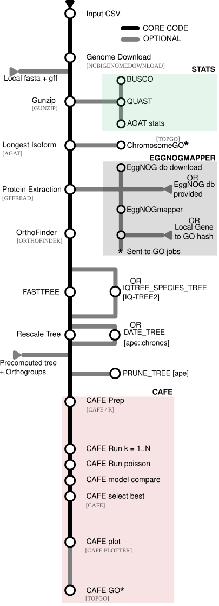

# EXCON (v2.4.0)

A Nextflow pipeline for gene family **EX**pansion and **CON**traction analysis 
across multiple species using CAFE5.

Given a set of genome assemblies and annotations, EXCON builds orthogroups with 
OrthoFinder, fits and compares multiple CAFE models to identify gene families 
evolving at significantly different rates, and automatically selects the 
best-fitting model for downstream analysis. Optionally, GO enrichment analysis 
can be run on expanded and contracted gene families, and on genes grouped by 
chromosome.

It works with any set of species that have a genome (fasta) and annotation (gff) file. 
(minimum of 5 species ideally up to around 30). Maximum 100 species (normally). 

## Overview

The general pipeline logic is as follows:



* Downloads genome and annotation files from NCBI `[NCBIGENOMEDOWNLOAD]`, or you provide your own.
* Unzips the files, if necessary `[GUNZIP]`
* Sanitises GFF annotations and extracts longest isoform `[AGAT_SPKEEPLONGESTISOFORM]`.
* Gets the protein sequences `[GFFREAD]`.
* Renames the genes to gene name (as some will be isoform name) `RENAME_FASTA`.
* Finds orthologous genes across species `[ORTHOFINDER_CAFE]`, or accepts a pre-computed tree and orthogroups to skip this step (see `--input_tree` / `--input_orthogroups`).
* Optionally re-infers the species tree with IQ-TREE2 from a concatenated single-copy orthogroup alignment `[EXTRACT_SINGLE_COPY]`, `[ALIGN_SINGLE_COPY]`, `[CONCAT_SINGLE_COPY]`, `[IQTREE_SPECIES_TREE]`, `[ROOT_TREE]` (see `--iqtree_species_tree`).
* Rescales OrthoFinder branch lengths and converts to an ultrametric tree for CAFE `[RESCALE_TREE]`, `[CAFE_PREP]`, or time-calibrates it with `ape::chronos` when node ages are supplied `[DATE_TREE]` (see `--tree_calibrations`).
* Optionally restricts the analysis to one clade `[PRUNE_TREE]` (see `--cafe_clade` / `--cafe_species`).
* Prepares gene count input, estimates the error model, and builds an ultrametric tree `[CAFE_PREP]`.
* Runs CAFE5 with k=1 to k=`cafe_max_k` (default 6) rate categories in parallel `[CAFE_RUN_K]`.
* Compares all k runs by AIC and selects the best k `[CAFE_SELECT_K]`.
* Re-runs CAFE5 at the best k with Poisson birth-death (`-p`) `[CAFE_RUN_BEST]`.
* Compares uniform vs Poisson model at the best k by likelihood, selects the winner `[CAFE_MODEL_COMPARE]`.
* Plots gene family expansions and contractions for the best model `[CAFE_PLOT]`.

### Optional — GO enrichment (`--run_eggnog` or `--predownloaded_gofiles`)

* GO annotation can be run in two ways:
- **Run EggNOG-mapper** (`--run_eggnog`): assigns GO terms from scratch using the EggNOG database (~45 GB). 
  Provide `--eggnog_data_dir` to reuse a pre-downloaded copy and avoid re-downloading on every run.
- **Supply your own GO files** (`--predownloaded_gofiles`): if you already have gene-to-GO mappings, 
  point to a directory of `{species_id}.go.txt` files and skip EggNOG entirely (see [Parameters](#go-annotation-optional) below).
* Optionally downloads the EggNOG-mapper database `[EGGNOG_DOWNLOAD]`. Default is on, unless you provide it.
* Optionally assigns GO terms to genes using EggNOG-mapper `[EGGNOGMAPPER]`, or reads GO terms from user-supplied files.
* Optionally prepares GO gene lists from the best CAFE model results `[CAFE_GO_PREP]`.
* Optionally runs GO enrichment in parallel, one job per species/node 
  and direction (expansion/contraction) `[CAFE_GO_RUN]`.

### Optional — chromosome GO enrichment (`--chromo_go`, requires GO annotation)

* Optionally plots GO enrichment of genes by chromosome `[CHROMO_GO]`.
* Optionally summarizes GO enrichment by chromosome `[SUMMARIZE_CHROMO_GO]`.

### Optional — genome quality statistics (`--stats`)

* Optionally describes genome assembly and annotation:
  - `[BUSCO_BUSCO]`: Completeness of the genome compared to expected gene set.
  - `[QUAST]`: Assembly contiguity statistics (N50 etc).
  - `[AGAT_SPSTATISTICS]`: Gene, exon, and intron statistics.

## Installation

Nextflow pipelines require a few prerequisites. There is further documentation on the nf-core webpage [here](https://nf-co.re/docs/usage/installation), about how to install Nextflow.

### Prerequisites

- [Docker](https://docs.docker.com/engine/install/) or [Singularity](https://docs.sylabs.io/guides/3.11/admin-guide/installation.html).
- [Java](https://www.java.com/en/download/help/download_options.html) and [openJDK](https://openjdk.org/install/) >= 8 (**Please Note:** When installing Java versions are `1.VERSION` so `Java 8` is `Java 1.8`).
- [Nextflow](https://www.nextflow.io/docs/latest/getstarted.html) >= `v26.04.6`. The pipeline uses the strict configuration/script syntax and typed parameter declarations, both of which require Nextflow 26. Older versions are rejected by the manifest.

### Install

To install the pipeline please use the following commands but replace VERSION with a [release](https://github.com/Eco-Flow/excon/releases).

`wget https://github.com/Eco-Flow/excon/archive/refs/tags/VERSION.tar.gz -O - | tar -xvf -`

or

`curl -L https://github.com/Eco-Flow/excon/archive/refs/tags/VERSION.tar.gz --output - | tar -xvf -`

This will produce a directory in the current directory called `excon-VERSION` which contains the pipeline.

## Inputs

### Required

* `--input /path/to/csv/file` - A singular csv file as input in one of the two formats stated below.

This csv can take 2 forms:
* A 2 field csv where each row is a unique species name followed by a Refseq genome reference ID (**NOT** a Genbank reference ID) i.e. `data/input_small-s3.csv`. The pipeline will download the relevant genome fasta file and annotation gff3 (or gff augustus) file.
* A 3 field csv where each row is a unique species name, followed by an absolute path to a genome fasta file, followed by an absolute path to an annotation gff3 (or gff augustus) file. Input can be gzipped (.gz) or not.

**Please Note:** The genome has to be chromosome level not contig level.

2 fields (Name,Refseq_ID):
```
Drosophila_yakuba,GCF_016746365.2
Drosophila_simulans,GCF_016746395.2
Drosophila_santomea,GCF_016746245.2
```

3 fields (Name,genome.fna,annotation.gff):
```
Drosophila_yakuba,data/Drosophila_yakuba/genome.fna.gz,data/Drosophila_yakuba/genomic.gff.gz
Drosophila_simulans,data/Drosophila_simulans/genome.fna.gz,data/Drosophila_simulans/genomic.gff.gz
Drosophila_santomea,data/Drosophila_santomea/genome.fna.gz,data/Drosophila_santomea/genomic.gff.gz
```

> **Note:** Genomes should be chromosome-level, not contig-level. RefSeq IDs must be used (not GenBank IDs).

## Parameters

### Core options

| Parameter | Description | Default |
|-----------|-------------|---------|
| `--input` | Path to input CSV file | Required unless using `--input_tree` + `--input_orthogroups` without `--run_eggnog` or `--stats` |
| `--outdir` | Output directory | `results` |
| `--groups` | NCBI taxonomy group for genome download (e.g. `insects`, `bacteria`) | `insects` |
| `--help` | Display help message | `false` |
| `--custom_config` | Path to a custom Nextflow config file | `null` |
| `--ncbi_max_forks` | Genome downloads to run concurrently. Each parses the full NCBI assembly summary for its taxonomic group, so fewer at once can be faster on a laptop; raise it on a cluster | `10` |
| `--forks` | Cap on how many tasks of each process run in parallel | `null` (unlimited) |
| `--publish_dir_mode` | How results are placed in `--outdir`: `copy`, `symlink`, `link`, … | `copy` |
| `--clean` | Delete work directories when the pipeline completes | `false` |

### Quality statistics (optional)

| Parameter | Description | Default |
|-----------|-------------|---------|
| `--stats` | Run BUSCO, QUAST and AGAT statistics on genomes | `null` |
| `--busco_lineage` | BUSCO lineage database (e.g. `insecta_odb10`) | `null` |
| `--busco_mode` | BUSCO mode (`genome`, `proteins`, `transcriptome`) | `null` |
| `--busco_lineages_path` | Path to local BUSCO lineage databases | `null` |
| `--busco_config` | Path to BUSCO config file | `null` |

### Internal stop codons (optional)

`RENAME_FASTA` translates each species' CDS to protein and writes `results/proteomes/<species>.clean.fasta`,
the input OrthoFinder actually receives. `GFFREAD` is run with `-S`, so gffread marks every stop
codon it translates with `*` (its own default is `.`, which this pipeline's detection can't see —
without `-S` a premature stop would pass through silently). gffread never prints the true terminal
stop itself, trimming it internally before output, so any `*` found in the translated sequence
means the CDS has a **premature stop**: a common sign of a bad gene model (an assembly gap, a
frameshift, an annotation error, or two species annotated by different pipelines with different
stringency). `--internal_stop_action` controls what happens to that gene:

| Parameter | Description | Default |
|-----------|-------------|---------|
| `--internal_stop_action` | `longest_orf`, `strip` or `drop` (see below) | `longest_orf` |

* **`longest_orf`** (default) keeps only the single longest stretch of sequence between stops —
  still within the reading frame the annotation already defines (this is not a 3-/6-frame search
  for an alternative ORF, just the longest real fragment of the one CDS translation gffread
  produced). A gene that is mostly correct with one truncating error near an end keeps most of its
  length and is likely to still resolve to the right orthogroup, rather than being spliced into a
  chimera (`strip`) or lost outright (`drop`). It is the weakest option when the true premature
  stop is near the start or middle of the gene, since the surviving fragment may then be too short
  to place reliably.
* **`strip`** removes every `*` in the sequence, including internal ones, which splices the
  peptide before and after the premature stop into one contiguous sequence. This keeps every gene
  in the analysis, but the spliced sequence is not a real protein — it may not resemble the gene's
  true product at all, and could coincidentally resemble something else entirely (the two flanking
  fragments are, in general, unrelated to each other).
* **`drop`** discards the whole gene instead — the behaviour [OrthoFinder's own documentation
  recommends](https://github.com/davidemms/OrthoFinder) for genes with internal stops, and what
  the CAFE5 tutorial's own filtering step assumes has already happened upstream. The gene is
  absent from that species' proteome entirely, rather than present with a fabricated sequence. The
  cost is the mirror image of `strip`'s: a real ortholog with an otherwise-correct gene model can
  vanish from that species' count purely because of one annotation-error stop, which for CAFE5
  looks indistinguishable from a genuine lineage-specific loss.

Either way, every affected gene is listed in `results/proteomes/<species>.internal_stop_codons.tsv`
(`gene_id`, `action` taken, `original_length`, `kept_length`), so the choice can be audited
regardless of which one you pick — `kept_length` in particular shows how much of `longest_orf`'s
output actually survived per gene, which the action label alone doesn't convey. `longest_orf` is
the default because it is the best general-purpose compromise for count-based analyses like
CAFE5 — it avoids `strip`'s chimera risk while, unlike `drop`, not zeroing out a species for a
gene that is mostly real. `strip` is still worth choosing if you specifically want to keep every
gene present regardless of sequence purity (e.g. feeding a downstream step that only cares about
gene presence/absence, not the sequence); `drop` if you want counts free of any fabricated or
truncated sequence at all, and can accept the corresponding risk of losing real genes to
annotation noise.

### OrthoFinder options (optional)

| Parameter | Description | Default |
|-----------|-------------|---------|
| `--orthofinder_v2` | Use OrthoFinder v2.5.5 instead of v3.1.4. v2 produces Hierarchical Orthogroups (`N0.tsv`) which have lower copy-number variance and are better suited to CAFE5. v3 produces flat orthogroups (`Orthogroups.tsv`). Recommended for large datasets (>30 species) or when CAFE5 fails to converge. | `false` |
| `--orthofinder_method` | Gene tree inference method: `msa` or `dendroblast` | `msa` |
| `--orthofinder_search` | Sequence search program: `diamond`, `blast`, or `mmseqs2` | `diamond` |
| `--orthofinder_msa_prog` | MSA program (requires `--orthofinder_method msa`): `mafft` or `muscle` | `mafft` |
| `--orthofinder_tree` | Tree inference method (requires `--orthofinder_method msa`): `fasttree`, `raxml`, `raxml-ng`, or `iqtree` | `fasttree` |
| `--orthofinder_blast_results` | Path to a blast `WorkingDirectory` from a previous `ORTHOFINDER_BLAST` run (published to `results/orthofinder_blast/`). Skips the DIAMOND search and runs only orthogroup inference and phylogeny — useful for resuming after a failed phylogeny stage or retrying with different tree options | `null` |

> **Note:** `-A` and `-T` are only valid when `-M msa` is set. If you set `--orthofinder_msa_prog` or `--orthofinder_tree` without `--orthofinder_method msa`, OrthoFinder will error.

### Species tree with IQ-TREE2 (optional)

By default the species tree passed to CAFE5 is the one OrthoFinder infers itself (STAG/STRIDE
over per-orthogroup gene trees, built with FastTree unless `--orthofinder_tree` says otherwise).
`--iqtree_species_tree` replaces that with a supermatrix maximum-likelihood tree, which is the
more standard approach for a published species phylogeny:

1. `[EXTRACT_SINGLE_COPY]` writes one FASTA per strictly single-copy, complete orthogroup,
   taking each sequence from the proteome of the species named in `Orthogroups.tsv`.
2. `[ALIGN_SINGLE_COPY]` aligns each of those orthogroups with MAFFT.
3. `[CONCAT_SINGLE_COPY]` concatenates them into one supermatrix, writing a partition file
   with one partition per orthogroup.
4. `[IQTREE_SPECIES_TREE]` runs IQ-TREE2 on that supermatrix under the edge-proportional
   partition model (`-spp partitions.txt`) with per-partition model selection (`-m MFP`),
   1000 ultrafast bootstrap and 1000 SH-aLRT replicates.
5. `[ROOT_TREE]` roots the result, because IQ-TREE2 returns an unrooted tree and CAFE5 requires
   a rooted one.

The rooted tree then feeds the normal `RESCALE_TREE` → `CAFE_PREP` path, so `--tree_scale_factor`
and the rest of the CAFE options behave exactly as before.

| Parameter | Description | Default |
|-----------|-------------|---------|
| `--iqtree_species_tree` | Infer the species tree with IQ-TREE2 from a concatenated single-copy orthogroup alignment instead of using the OrthoFinder tree. Works with any `--orthofinder_method`. | `false` |
| `--iqtree_outgroup` | Comma-separated tip name(s) to root the tree on, matching the sample names in your input CSV. Must be monophyletic in the inferred tree. If unset, the tree is midpoint-rooted. | `null` (midpoint) |
| `--iqtree_args` | Extra arguments appended to the IQ-TREE2 command line, e.g. `-mset LG,WAG,JTT` to restrict ModelFinder's candidate matrices, or `--gcf` for gene concordance factors. | `null` |
| `--iqtree_partition_file` | Reuse an existing partition file instead of the generated one, so model selection is not repeated. A previous run's `iqtree/species_tree.best_scheme` records the model chosen for each partition; the coordinates must match the supermatrix, so only use a file produced from the same orthogroups. Supplying it suppresses the default `-m MFP` | `null` |
| `--iqtree_partition_model` | Model written per partition. `AA` lets ModelFinder pick one per orthogroup; set e.g. `LG+F+G4` to fix it and skip model selection. With a partition file the model has to be set here rather than through `--iqtree_args '-m ...'`. | `AA` |

```bash
nextflow run main.nf \
  --input input.csv \
  --iqtree_species_tree \
  --iqtree_outgroup Drosophila_yakuba \
  -profile docker
```

Outputs are written to `results/species_tree/`:

| File | Description |
|------|-------------|
| `SpeciesTree_rooted.nwk` | The rooted tree used for CAFE5 |
| `iqtree/species_tree.treefile` | Unrooted IQ-TREE2 ML tree with support values |
| `iqtree/species_tree.iqtree` | IQ-TREE2 report, including the model chosen per partition |
| `supermatrix/supermatrix.faa` | Concatenated alignment |
| `supermatrix/partitions.txt` | Partition boundaries, one per orthogroup |

> **No particular `--orthofinder_method` is needed.** The single-copy orthogroups are aligned
> by the pipeline itself, so this works with OrthoFinder's default (DendroBLAST) mode as well
> as `-M msa`. The default is considerably faster, since `-M msa` aligns *every* orthogroup and
> builds a gene tree for each, while only the single-copy ones are needed here.
> `--iqtree_species_tree` cannot be combined with `--input_tree`/`--input_orthogroups`, since
> those skip OrthoFinder entirely.

### Reusing a finished run

`--orthofinder_results` points at the results directory of a completed OrthoFinder run, so it
is not repeated and the orthogroup/HOG identifiers are preserved exactly. With
`--iqtree_species_tree` it also needs `--proteome_dir`, holding the proteomes those gene IDs
refer to (`results/proteomes/`, written by `RENAME_FASTA`). Add `--skip_cafe` to build a
species tree and nothing else:

```bash
nextflow run main.nf \
  --iqtree_species_tree --skip_cafe \
  --orthofinder_results /path/to/results/orthofinder_cafe/ortho_cafe \
  --proteome_dir /path/to/results/proteomes \
  -profile docker
```

If the run predates `results/proteomes/`, or its work directory has been deleted, two scripts
in `bin/` rebuild the proteomes from published output. Both reproduce the originals exactly:

| script | needs | use when |
|--------|-------|----------|
| `proteomes_from_orthofinder.py -r <orthofinder results> -o proteomes` | the OrthoFinder `WorkingDirectory/` | preferred — these are the exact sequences OrthoFinder was given |
| `rename_fasta_standalone.py -f results/gffread -g results/agat -o proteomes` | published GFFREAD + AGAT output | the OrthoFinder directory is incomplete |

> **Give `IQTREE_SPECIES_TREE` plenty of memory on a scheduler.** IQ-TREE rejects its own
> `-mem` flag when a partition model is in use, so the pipeline cannot cap its memory and
> IQ-TREE will use what it needs. On SGE/SLURM, request generously (the `withName` block sets
> 8 CPUs / 16 GB by default, which a large supermatrix will outgrow) or the scheduler will
> kill the job.

> **Per-partition model selection dominates the runtime.** `-m MFP` fits every candidate
> amino-acid model to every partition independently, so a few hundred orthogroups means tens of
> thousands of model fits before tree search even starts. If that is too slow, narrow the
> candidate set with `--iqtree_args '-mset LG,WAG,JTT'`, or skip selection entirely with
> `--iqtree_partition_model LG+F+G4`. Note IQ-TREE rejects `-m <model>` alongside a partition
> file, so the fixed model must go in the partition file via that parameter.

> **Only orthogroups present exactly once in every species are used.** With many species, or
> with fragmented annotations, this set can get small — `CONCAT_SINGLE_COPY` reports how many
> orthogroups it kept and why the rest were dropped, so check that count in the log.

> **A better tree is not automatically a correctly placed taxon.** Supermatrix ML concatenation
> is exactly the setting where incomplete lineage sorting and gene-tree conflict can produce a
> strongly supported but wrong branch. If a specific node is in question, check gene concordance
> factors (`--iqtree_args '--gcf ...'`) or compare against a coalescent method, rather than
> assuming the ML tree settles it.

### Analysing one clade at a time (optional)

Including distantly related outgroups is often good for orthology inference but bad for CAFE5:
families absent from the outgroups are empty at the analysis root, and CAFE5 discards those —
which tends to remove exactly the lineage-specific families of interest (odorant receptors,
P450s and so on). Running CAFE on a clade at a time avoids that, without re-running OrthoFinder
and without changing orthogroup identifiers.

| Parameter | Description | Default |
|-----------|-------------|---------|
| `--cafe_clade` | Two or more tip names; everything descended from their most recent common ancestor is analysed, e.g. `Drosophila_yakuba,Drosophila_santomea` | `null` |
| `--cafe_species` | An explicit set of tips instead: a comma-separated list, or a path to a file with one name per line | `null` |

Give one or the other, not both. The species tree is pruned to the selection and `cafe_prep.R`
subsets the gene-count table to match, so the same OrthoFinder output can be analysed clade by
clade by changing one option:

```bash
# same inputs, one clade per run
nextflow run main.nf --input_tree species_tree.nwk --input_orthogroups N0.tsv \
  --tree_calibrations calibrations.tsv \
  --cafe_clade "Drosophila_yakuba,Drosophila_simulans" --outdir clade_a -profile docker

nextflow run main.nf --input_tree species_tree.nwk --input_orthogroups N0.tsv \
  --tree_calibrations calibrations.tsv \
  --cafe_clade "Drosophila_yakuba,Drosophila_santomea" --outdir clade_b -profile docker
```

`results/species_tree/pruned_tree_species.tsv` records which species were retained and dropped.

> **Pruning happens after time-calibration, deliberately.** The tree is dated once using every
> species, so calibrations may reference taxa that fall outside the clade being analysed, and
> both subsets inherit the same ages. Pruning preserves node ages and ultrametricity, so a
> calibrated tree stays calibrated.

> **Defining a clade by an MRCA can capture more than you expect.** Pick two tips that span the
> group: for a genus, two of its most divergent members, not two close relatives. Check
> `pruned_tree_species.tsv` to confirm the selection is what you intended.

### Time-calibrating the species tree (optional)

CAFE5 estimates λ per unit of branch length, so λ is only a rate *per million years* if the
tree is on a time axis. Without calibrations the pipeline makes the tree ultrametric with
`chronoMPL()` and scales it by `--tree_scale_factor`, which is enough for CAFE5 to run but
leaves λ in arbitrary units and can distort branch-specific significance.

`--tree_calibrations` instead time-calibrates the tree with `ape::chronos` using node ages you
supply. It applies to whichever species tree is in use — OrthoFinder's or the one from
`--iqtree_species_tree` — and the calibrated tree is then passed to **every** CAFE5 stage
unchanged (no `chronoMPL()`, no `--tree_scale_factor`), exactly as `--input_tree_is_dated` does
for an externally dated tree.

The calibration file is a TSV with a header:

```tsv
clade	tips	age_min	age_max
crown_group	Species_A,Species_F	120	120
subclade_1	Species_A,Species_C	64	64
subclade_2	Species_D,Species_F	38	45
```

The names and ages above are placeholders: use your own tip names and calibrations.

| column | meaning |
|--------|---------|
| `clade` | label used in the report; not interpreted |
| `tips` | two or more tip names — the calibrated node is their **most recent common ancestor** |
| `age_min` / `age_max` | age bounds in millions of years; set them equal to fix the age |

Naming nodes by an MRCA rather than a node number means the file stays valid across trees, and
tip names may be given with or without the internal `.clean` suffix.

```bash
nextflow run main.nf \
  --input input.csv \
  --iqtree_species_tree \
  --tree_calibrations calibrations.tsv \
  -profile docker
```

Outputs are written to `results/species_tree/`:

| File | Description |
|------|-------------|
| `SpeciesTree_dated.nwk` | Ultrametric tree, branch lengths in millions of years, used for CAFE5 |
| `dating_calibrations.tsv` | Each calibration with the node it resolved to and the age actually fitted |
| `dating_qc.tsv` | Model settings, root age, shortest branch, ultrametric/binary checks |

`--chronos_model` (`discrete`, `correlated`, `relaxed`), `--chronos_lambda` and
`--chronos_rate_categories` tune the fit.

> **Dating failures are fatal, by design.** `ape::chronos` reports non-convergence as a
> *warning* and still returns a tree, so the pipeline treats any chronos warning as an error
> rather than publishing a tree that did not converge. It also checks that the fitted node ages
> match the calibrations you asked for, and that the result is ultrametric and binary.

> **Calibrations are yours to justify.** The pipeline applies the ages you give it; it has no
> opinion on which fossils or published estimates are appropriate. Record their provenance —
> `dating_calibrations.tsv` is published to make that easy.

### CAFE gene family evolution

| Parameter | Description | Default |
|-----------|-------------|---------|
| `--skip_cafe` | Skip CAFE analysis | `null` |
| `--cafe_max_k` | Maximum number of k rate categories to test (runs k=1 through k=N in parallel) | `6` |
| `--cafe_max_differential` | Maximum gene count differential (max − min copies) for CAFE filtering. `CAFE_PREP` retries with this threshold, halving it on each subsequent retry | `50` |
| `--cafe_filter_first` | Apply that threshold from the **first** attempt rather than only on retries | `false` |
| `--tree_calibrations` | TSV of node ages used to time-calibrate the species tree with `ape::chronos`, so CAFE5's λ is per million years. See [Time-calibrating the species tree](#time-calibrating-the-species-tree-optional). Skips `--tree_scale_factor` and `chronoMPL()`. | `null` |
| `--chronos_model` | `ape::chronos` rate model: `discrete`, `correlated` or `relaxed` | `discrete` |
| `--chronos_lambda` | `ape::chronos` rate-smoothing parameter | `1` |
| `--chronos_rate_categories` | Rate categories for the `discrete` model | `10` |
| `--tree_scale_factor` | Factor to multiply all species-tree branch lengths by before `chronoMPL()` converts the tree to a time tree for CAFE5. Applied once, by `RESCALE_TREE`. Lower values can cause numerical issues. CAFE5's λ is per unit branch length, so changing this rescales λ by the same factor. | `1000` |
| `--input_tree` | Path to a pre-computed rooted species tree (Newick format) — skips OrthoFinder when used with `--input_orthogroups` | `null` |
| `--input_orthogroups` | Path to a pre-computed `Orthogroups.tsv`/`N0.tsv` from a previous OrthoFinder run — skips OrthoFinder when used with `--input_tree` | `null` |
| `--input_tree_is_dated` | Treat `--input_tree` as an already time-calibrated, ultrametric tree (branch lengths in Myr). Passed to every CAFE5 stage unchanged (no `RESCALE_TREE`, no `chronoMPL()`, no rescaling). λ is then per-Myr. | `false` |
| `--cafe_zero_root` | Pass CAFE5's `-z/--zero_root` to all CAFE5 calls, retaining families with zero inferred copies at the root (sensitivity analysis). | `false` |
| `--cafe_focus_clades` | Focus node(s) for alignment/gene-tree retrieval: CAFE node label(s) or `\|`-separated tip-species sets whose MRCA defines a node (robust to CAFE renumbering). | `null` |
| `--orthofinder_msa_dir` | OrthoFinder `MultipleSequenceAlignments/` dir; with `--orthofinder_genetree_dir` and `--cafe_focus_clades`, copies out alignments/trees of families significantly expanded at the focus node(s). | `null` |
| `--orthofinder_genetree_dir` | OrthoFinder `Resolved_Gene_Trees/` directory. See `--orthofinder_msa_dir`. | `null` |

> **Species-subset CAFE with a dated tree.** To run CAFE on a subset of species while reusing the
> HOG definitions of a larger OrthoFinder v2 analysis, supply the full `N0.tsv`
> together with a smaller time-calibrated tree and `--input_tree_is_dated`. `cafe_prep.R` subsets the
> `N0.tsv` columns to exactly the tree's species (keeping the original HOG identifiers), removes HOGs
> that become empty after subsetting, then removes single-species families — recording the reason for
> every exclusion in `hog_filtering_report.tsv`. Run the pipeline once per subset:
> ```
> nextflow run main.nf --orthofinder_v2 \
>   --input_orthogroups N0.tsv \
>   --input_tree subset_dated.nwk --input_tree_is_dated \
>   --cafe_focus_clades "Species_A,Species_B|Species_A,Species_D" \
>   --orthofinder_msa_dir MultipleSequenceAlignments/ \
>   --orthofinder_genetree_dir Resolved_Gene_Trees/ \
>   --outdir results_subset
> ```
> Add `--cafe_zero_root` for the parallel sensitivity run that keeps zero-at-root families (odorant/
> gustatory receptors etc.). Set `--cafe_max_differential 20` to match Vizueta et al. 2025.

> **When CAFE5 fails to converge.** Families spanning a very wide range of copy numbers give
> infinite likelihoods, and CAFE5 reports this as `Failed to initialize any reasonable values`
> alongside a list of the families with the largest differentials. `CAFE_PREP` responds by
> retrying with progressively stricter filtering — by default the first attempt is unfiltered so
> that nothing is discarded unnecessarily, then `--cafe_max_differential`, then half that, then a
> quarter. If you already know the data need filtering, `--cafe_filter_first` starts at the
> threshold immediately: the unfiltered attempt would otherwise be a guaranteed failure costing a
> full CAFE5 run, which on a large analysis is expensive.
>
> ```bash
> --cafe_max_differential 20 --cafe_filter_first   # thresholds: 20 -> 10 -> 5 -> 2
> ```
>
> Each attempt escalates its time and memory request, so check that your scheduler permits the
> escalated wall time — a retry asking for more than the queue maximum is rejected at submission
> and fails instantly, which looks like a convergence failure but is not one.

> **What happens to the filtered-out families.** Families above the differential threshold are
> not discarded — `hog_gene_counts_large.tsv` is analysed separately in `cafe/large_families/`.
> Each family is run **independently**, fitting its own λ, rather than as one shared batch: a
> single shared λ cannot explain both a modest and an extreme size differential at once, so
> lumping every high-differential family together into one CAFE5 call tends to be unfittable
> regardless of λ. Running them one at a time removes that conflict, since a single family
> imposes none. The converged per-family runs are stitched back into one CAFE5-shaped directory
> (`cafe/large_families/Out_cafe_large/`) so `cafe_plot_large/` and `cafe_go_large/` read it exactly
> like an ordinary CAFE5 result; `large_family_lambda_summary.tsv` records each family's own fitted
> λ and -lnL, since there is no longer one shared value to report. `CAFE_SIG_FAMILIES` also runs on
> this merged result, and its output is concatenated with the main model's into
> `cafe/significant_families/combined_changes_per_node.tsv` /
> `combined_significant_changes_per_node.tsv`, tagged by a `source` column (`main_model` vs
> `large_family_own_lambda`) — one report spanning every orthogroup CAFE5 could fit at all. A
> family that still fails to converge even on its own is dropped from the merge with a warning,
> rather than failing the run.

> **Skipping OrthoFinder:** OrthoFinder is the slowest step in the pipeline. If you have already run it
> (the results are in `results/orthofinder_cafe/ortho_cafe/`), you can reuse the outputs.
> The orthogroups file to pass depends on which version of OrthoFinder was used:
>
> **OrthoFinder v2 (`--orthofinder_v2`)** — use `N0.tsv` (Hierarchical Orthogroups):
> ```
> --input_tree results/orthofinder_cafe/ortho_cafe/Species_Tree/SpeciesTree_rooted_node_labels.txt \
> --input_orthogroups results/orthofinder_cafe/ortho_cafe/Phylogenetic_Hierarchical_Orthogroups/N0.tsv
> ```
>
> **OrthoFinder v3 (default)** — use `Orthogroups.tsv` (flat orthogroups):
> ```
> --input_tree results/orthofinder_cafe/ortho_cafe/Species_Tree/SpeciesTree_rooted_node_labels.txt \
> --input_orthogroups results/orthofinder_cafe/ortho_cafe/Orthogroups/Orthogroups.tsv
> ```
> Both `--input_tree` and `--input_orthogroups` must be supplied together. If either is omitted, OrthoFinder runs normally.

> **Note on CAFE model selection:** The pipeline runs CAFE5 with k=1 through k=`cafe_max_k` (default 6) 
> rate categories in parallel, then selects the best k by AIC. It then re-runs the best k with the 
> Poisson birth-death option (`-p`) and picks the final model by likelihood. Model selection results 
> (AIC table across k values) are in `results/cafe/model_comparison/`. If scores cannot be parsed 
> (e.g. on very small datasets), the pipeline defaults to the uniform model.

### GO annotation (optional)

GO enrichment requires gene-to-GO mappings. Choose one of the two approaches below — they are mutually exclusive, and `--run_eggnog` takes priority if both are set.

#### Option A — Run EggNOG-mapper

| Parameter | Description | Default |
|-----------|-------------|---------|
| `--run_eggnog` | Run EggNOG-mapper to assign GO terms | `false` |
| `--eggnog_data_dir` | Path to pre-downloaded EggNOG database directory | `null` (downloads ~45 GB automatically) |
| `--eggnog_target_taxa` | Restrict annotations to orthologs from this taxon and its descendants (NCBI taxon ID) | `null` |
| `--eggnog_tax_scope` | Taxonomic scope for orthologous group assignment (e.g. `50557` for Insecta) | `null` |
| `--eggnog_evalue` | Maximum e-value threshold for sequence matches | `null` |
| `--eggnog_score` | Minimum bitscore threshold for matches | `null` |
| `--eggnog_pident` | Minimum percent identity (%) | `null` |
| `--eggnog_query_cover` | Minimum query coverage (%) | `null` |
| `--eggnog_subject_cover` | Minimum subject coverage (%) | `null` |
| `--eggnog_rep_species` | Species to use as the representative for the OG annotation summary (must match a species name in the input CSV). Auto-selects the most-annotated species when unset. | `null` (auto) |

> **Note:** The EggNOG database is ~45 GB. We strongly recommend downloading it once and passing `--eggnog_data_dir /path/to/eggnog_data` to avoid re-downloading on every run.

#### Option B — Supply your own GO files

| Parameter | Description | Default |
|-----------|-------------|---------|
| `--predownloaded_gofiles` | Path to a directory of pre-computed gene-to-GO mapping files | `null` |

The directory must contain one file per species, named `{species_id}.go.txt` where `species_id` matches the species names in your input CSV. Each file is a two-column, tab-separated file with one gene–GO pair per line:

```
geneA    GO:0006412
geneA    GO:0008150
geneB    GO:0003674
```

This lets you skip EggNOG entirely if you already have GO annotations (e.g. from a previous run, a public database, or another annotation tool).

### GO enrichment analysis (optional, requires GO annotation)

| Parameter | Description | Default |
|-----------|-------------|---------|
| `--chromo_go` | Run GO enrichment analysis by chromosome | `null` |
| `--go_cutoff` | P-value cutoff for GO enrichment | `0.05` |
| `--go_type` | GO test type (e.g. `none`) | `none` |
| `--go_max_plot` | Maximum number of GO terms to plot | `10` |
| `--go_algo` | topGO algorithm and statistic (`classic_fisher`, `weight01_t`, `elim_ks`, `weight_ks`). Results are written to a subfolder named after all three GO settings (e.g. `cafe_go/weight01_t_cutoff0.05_typenone/`), so running with different values preserves all results. | `classic_fisher` |

### Resource limits

| Parameter | Description | Default |
|-----------|-------------|---------|
| `--max_memory` | Maximum memory per job | `128.GB` |
| `--max_cpus` | Maximum CPUs per job | `16` |
| `--max_time` | Maximum runtime per job | `240.h` |

## Profiles

| Profile | Description |
|---------|-------------|
| `docker` | Run with Docker containers |
| `singularity` | Run with Singularity containers |
| `conda` | Run with Conda environments |
| `test_bacteria` | Fastest smoke test: 4 small bacterial genomes. Exercises every step, but CAFE5 does not converge on it (see below) |
| `test_chlamydia` | 10 *Chlamydia* genomes. Slower than `test_bacteria`, but closely related enough for CAFE5 to fit a model, so it exercises the CAFE stages end to end |
| `test_small` | Test run with small insect genomes |


## Profiles

This pipeline is designed to run in various modes that can be supplied as a comma separated list i.e. `-profile profile1,profile2`.

### Container Profiles

Please select one of the following profiles when running the pipeline.

* `docker` - This profile uses the container software Docker when running the pipeline. This container software requires root permissions so is used when running on cloud infrastructure or your local machine (depending on permissions). **Please Note:** You must have Docker installed to use this profile.
* `singularity` - This profile uses the container software Singularity when running the pipeline. This container software does not require root permissions so is used when running on on-premise HPCs or you local machine (depending on permissions). **Please Note:** You must have Singularity installed to use this profile.
* `apptainer` - This profile uses the container software Apptainer when running the pipeline. This container software does not require root permissions so is used when running on on-premise HPCs or you local machine (depending on permissions). **Please Note:** You must have Apptainer installed to use this profile.

### Optional Profiles

* `local` - This profile is used if you are running the pipeline on your local machine.
* `aws_batch` - This profile is used if you are running the pipeline on AWS utilising the AWS Batch functionality. **Please Note:** You must use the `Docker` profile with with AWS Batch.
* `test_small` - This profile is used if you want to test running the pipeline on your infrastructure, running from predownloaded go files. **Please Note:** You do not provide any input parameters if this profile is selected but you still provide a container profile.

> **Which test profile to use.** `test_bacteria` (4 *Mycoplasmoides*) is the quickest way to check the
> pipeline runs, but those species are too divergent for CAFE5: about half the orthogroups are identical
> across all four, leaving almost no copy-number variation across just two internal branches, so
> `CAFE_PREP` exhausts its retries and the error is ignored. That is a property of the dataset, not a
> pipeline fault. Use `test_chlamydia` (10 species in one genus) when you need the CAFE stages
> themselves to be exercised.

## Custom Configuration

If you want to run this pipeline on your institute's on-premise HPC or specific cloud infrastructure then please contact us and we will help you build and test a custom config file. This config file will be published to our [configs repository](https://github.com/Eco-Flow/configs). 

## Running the Pipeline

**Please note:** The `-resume` flag uses previously cached successful runs of the pipeline.

1. Example run the full test example data:

```
NXF_VER=25.04.8 # Is latest it is tested on
nextflow run main.nf -resume -profile docker,test_small
```

*Settings in test_small:*
input = "input_small-s3.csv"

For the fastest run use: `nextflow run main.nf -resume -profile docker,test_bacteria`

2. To run on your own data (minimal run), cafe only. 

```
# NXF_VER=25.04.8  
nextflow run main.nf -resume -profile docker --input data/input_small-s3.csv
```

3. To run with cafe and GO analysis

```
# NXF_VER=25.04.8
nextflow run main.nf -resume -profile docker --input data/input_small-s3.csv --chromo_go --go_type bonferoni --stats --run_eggnog --eggnog_data_dir /path/to/eggnogdb 
```

4. To run with CAFE and GO analysis using your own pre-computed GO files (skips EggNOG):

```
# NXF_VER=25.04.8
nextflow run main.nf -resume -profile docker --input data/input_small-s3.csv --predownloaded_gofiles /path/to/go_files/
```

The `go_files/` directory should contain one `{species_id}.go.txt` per species (tab-separated `gene_id<TAB>GO:term`, one pair per line).

5. To reuse a previous OrthoFinder run (skips the slow OrthoFinder step). Or to use tree/table from another source use:

OrthoFinder v3 (default):
```
# NXF_VER=25.04.8
nextflow run main.nf -resume -profile docker \
  --input data/input_small-s3.csv \
  --input_tree results/orthofinder_cafe/ortho_cafe/Species_Tree/SpeciesTree_rooted_node_labels.txt \
  --input_orthogroups results/orthofinder_cafe/ortho_cafe/Orthogroups/Orthogroups.tsv
```

OrthoFinder v2 (`--orthofinder_v2`):
```
# NXF_VER=25.04.8
nextflow run main.nf -resume -profile docker \
  --input data/input_small-s3.csv \
  --input_tree results/orthofinder_cafe/ortho_cafe/Species_Tree/SpeciesTree_rooted_node_labels.txt \
  --input_orthogroups results/orthofinder_cafe/ortho_cafe/Phylogenetic_Hierarchical_Orthogroups/N0.tsv
```

## Output Structure

> For a detailed description of outputs with example figures, see the **[Output Guide](docs/outputs.md)**.
```
results/
├── cafe/
│   ├── base/                        # CAFE_PREP outputs
│   │   ├── hog_gene_counts.tsv      # Filtered gene count input to CAFE
│   │   ├── hog_filtering_report.tsv # Filtering report (only present if retry triggered)
│   │   └── SpeciesTree_rooted_ultra.txt  # Ultrametric tree used by CAFE5
│   ├── best/                        # Full CAFE5 results for the winning model (uniform or Poisson)
│   ├── large_families/              # High-differential families, each run independently under its own lambda
│   └── model_comparison/
│       ├── cafe_model_comparison.tsv # Uniform vs Poisson comparison at best k
│       └── best_model.txt            # "uniform" or "poisson"
├── cafe_plot/
│   └── cafe_plotter/                # Expansion/contraction plots for best model
├── cafe_go/
│   └── <algo>_cutoff<val>_type<val>/  # One subfolder per GO parameter combination
│       ├── CAFE_summary.txt           # Summary of expansions/contractions per branch
│       ├── *_TopGo_results_ALL.tab    # TopGO results per target
│       ├── TopGO_barplot_*.pdf        # Bar chart per target (ggplot2, full GO names)
│       ├── TopGO_dotplot_*.pdf        # Dot plot per target (fold enrichment x significance)
│       ├── TopGO_Pval_barplot_*.pdf   # Legacy barplots (base R)
│       ├── Go_summary_pos.pdf         # Summary plot across all expansions
│       ├── Go_summary_neg.pdf         # Summary plot across all contractions
│       ├── Go_summary_pos_noNode.pdf  # As above, terminal branches only
│       └── Go_summary_neg_noNode.pdf
├── chromo_go/                         # [optional] GO enrichment by chromosome
│   └── <algo>_cutoff<val>_type<val>/  # One subfolder per GO parameter combination
│       ├── *.pdf                      # Per-chromosome GO plots
│       └── summary/                   # Summarized results across chromosomes
├── eggnogmapper/
│   ├── *.emapper.annotations        # Raw EggNOG-mapper annotation files (one per species)
│   ├── OG_annotation_summary.tsv    # Per-orthogroup functional summary (description, COG, KEGG, PFAM)
│   └── go_files/                    # Per-species GO annotation files
├── gffread/
│   └── *.fasta                      # Protein sequences per species
├── ncbigenomedownload/
│   ├── *.fna.gz                     # Downloaded genome assemblies
│   └── *.gff.gz                     # Downloaded annotations
├── orthofinder_cafe/
│   └── ortho_cafe/                  # OrthoFinder results including species tree
├── busco/                           # [optional, --stats] BUSCO completeness results
├── agat/                            # [optional, --stats] AGAT annotation statistics
├── quast/                           # [optional, --stats] Assembly contiguity statistics
└── pipeline_info/
    ├── execution_report_*.html      # Nextflow execution report
    ├── execution_timeline_*.html    # Per-process timeline
    ├── execution_trace_*.txt        # Per-task resource usage
    ├── pipeline_dag_*.html          # Pipeline DAG diagram
    └── software_versions.yml        # Versions of all tools used
```


## Citation

This pipeline is published on Workflowhub using the nf-core template. If you use this pipeline in you work, the following citations are essential:

excon:
Wyatt, C. (2026). Gene EXpansion and CONtraction analysis pipeline. WorkflowHub. https://doi.org/10.48546/WORKFLOWHUB.WORKFLOW.2141.8

nf-core:
Philip Ewels, Alexander Peltzer, Sven Fillinger, Harshil Patel, Johannes Alneberg, Andreas Wilm, Maxime Ulysse Garcia, Paolo Di Tommaso & Sven Nahnsen.
Nat Biotechnol. 2020 Feb 13. doi: 10.1038/s41587-020-0439-x.

If you used any of these tools within the pipeline, you must also cite:

CAFE:
Fábio K Mendes, Dan Vanderpool, Ben Fulton, Matthew W Hahn, CAFE 5 models variation in evolutionary rates among gene families, 
Bioinformatics, 2020; btaa1022, https://doi.org/10.1093/bioinformatics/btaa1022

Orthofinder:
Emms, D.M. and Kelly, S. (2019) OrthoFinder: phylogenetic orthology inference for comparative genomics. 
Genome Biology 20:238

AGAT:
Dainat J. 2022. Another Gtf/Gff Analysis Toolkit (AGAT): Resolve interoperability issues and accomplish more with your annotations. Plant and Animal Genome XXIX Conference. https://github.com/NBISweden/AGAT.

eggNOG-mapper (if used):
Carlos P Cantalapiedra, Ana Hernández-Plaza, Ivica Letunic, Peer Bork, Jaime Huerta-Cepas, eggNOG-mapper v2: Functional Annotation, Orthology Assignments, and Domain Prediction at the Metagenomic Scale, Molecular Biology and Evolution, Volume 38, Issue 12, December 2021, Pages 5825–5829, https://doi.org/10.1093/molbev/msab293

A full list of tools and their versions are found in the `software_versions.yml` in the `results/pipeline_info`. So ensure to look here for any additional tools you need to cite.

For the --stats module, you would need to cite BUSCO, Quast, AGAT

## Contact Us

If you need any support do not hesitate to contact us at any of:

`c.wyatt [at] ucl.ac.uk` 

`ecoflow.ucl [at] gmail.com`
