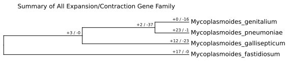
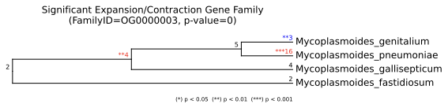
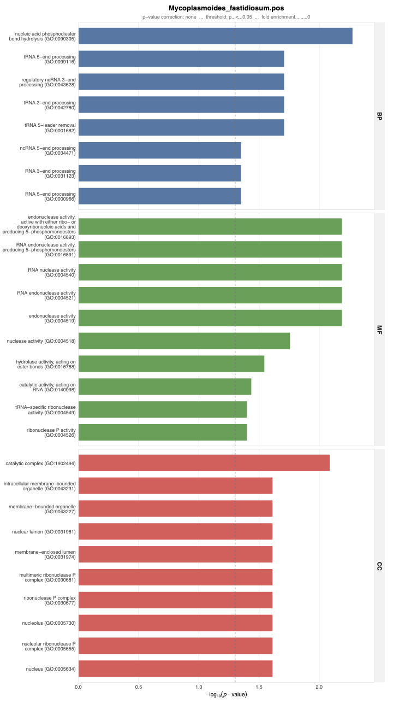
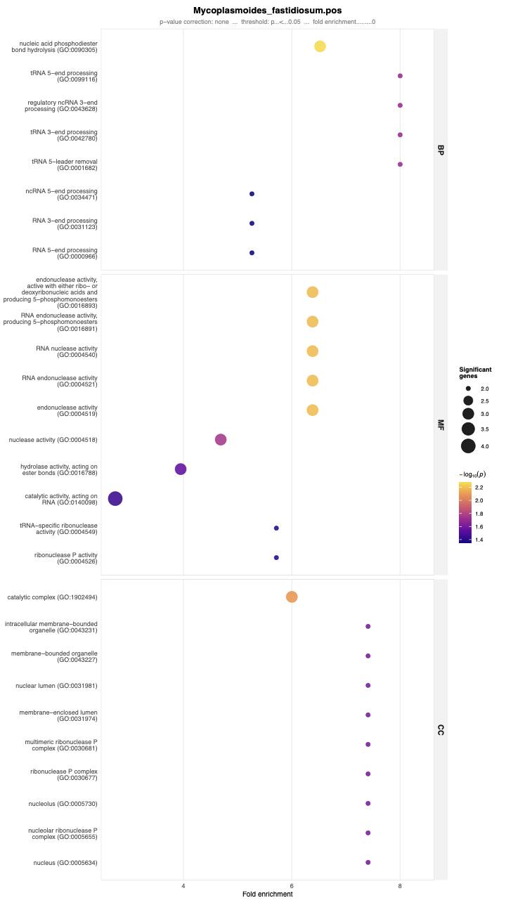

# EXCON Output Guide

This page describes the key outputs produced by the EXCON pipeline, with example figures from a test run on four *Mycoplasmoides* bacterial species.

To replicate this you run:

`nextflow run main.nf -profile docker,test_bacteria,mac -bg --orthofinder_v2 --predownloaded_gofiles data/mycoplasma_go_files -resume`

---

## Output Directory Structure

```
results/
├── cafe/                    # CAFE5 model fitting and selection
├── cafe_plot/               # Expansion/contraction visualisations
├── cafe_go/                 # GO enrichment results and plots
├── chromo_go/               # [optional] GO enrichment by chromosome (!won't work for mycoplasma!, only one chr)
├── eggnogmapper/            # [optional] EggNOG GO annotations
├── orthofinder_cafe/        # OrthoFinder species tree and orthogroups
├── busco/                   # [optional, --stats] BUSCO completeness
├── agat/                    # [optional, --stats] Annotation statistics
├── quast/                   # [optional, --stats] Assembly statistics
└── pipeline_info/           # Execution reports, DAG, software versions
```

---

## CAFE Expansion/Contraction Plots (`results/cafe_plot/`)

Produced by [CAFEPlotter](https://github.com/moshi4/CafePlotter) from the best-fitting CAFE5 model.

### Summary Tree

Shows the total number of significantly expanded (+) and contracted (−) gene families mapped onto each branch of the species tree.



*Example: four* Mycoplasmoides *species. Numbers on each branch show expanded/contracted gene family counts. Internal nodes represent ancestral lineages.*

---

### Individual Gene Family Trees

For each significantly evolving orthogroup, a tree shows the gene count at each node with colour-coded significance: red = expansion, blue = contraction. Asterisks indicate significance level (* p<0.05, ** p<0.01, *** p<0.001).



*Example: OG0000003 — massive expansion in* M. pneumoniae *(+16 genes, ***) and contraction in* M. genitalium *(−3 genes, **), consistent with genome size differences in this clade.*

---

## GO Enrichment Plots (`results/cafe_go/`)

GO enrichment is run per species per direction (expanded/contracted gene families). Two publication-quality plot types are produced for each.

### Bar Plot

Terms are grouped by ontology (CC / MF / BP), sorted by significance, and coloured by category. Full GO term names are retrieved from `GO.db` — topGO's internal truncation is bypassed. The GO ID is shown below each term.



*Example: expanded gene families in* Mycoplasmoides fastidiosum. *X-axis: −log₁₀(p-value). Colour: ontology (blue = CC, green = MF, red = BP). Dashed line: significance threshold.*

---

### Dot Plot

The dot plot adds two extra dimensions: dot **size** encodes the number of significantly expanded/contracted genes annotated to that term, and dot **colour** (plasma gradient) encodes −log₁₀(p-value). X-axis shows fold enrichment, making it easy to distinguish highly significant but modestly enriched terms from strongly enriched terms with fewer genes.



*Example: expanded gene families in* Mycoplasmoides fastidiosum. *X-axis: fold enrichment. Dot size: significant gene count. Dot colour: −log₁₀(p-value), yellow (less significant) → purple (more significant).*

---

### Output Files

| File | Description |
|------|-------------|
| `*_TopGo_results_ALL.tab` | Raw topGO results table with all p-value corrections and fold enrichment |
| `TopGO_barplot_*.pdf` | Horizontal bar chart (ggplot2) |
| `TopGO_dotplot_*.pdf` | Dot plot with fold enrichment and gene count (ggplot2) |
| `TopGO_Pval_barplot_*.pdf` | Legacy bar chart (base R, retained for compatibility) |

---

## CAFE Model Selection (`results/cafe/model_comparison/`)

| File | Description |
|------|-------------|
| `cafe_model_comparison.tsv` | AIC scores for k=1 through k=N rate categories |
| `best_model.txt` | Selected model: `uniform` or `poisson` at best k |

---

## Expansion/Contraction Plots (`results/cafe_plot/`)

Produced by [CAFEPlotter](https://github.com/moshi4/CafePlotter). Visualises which gene families expanded or contracted on each branch of the species tree under the best-fitting CAFE model.

---

## Pipeline Metadata (`results/pipeline_info/`)

| File | Description |
|------|-------------|
| `execution_report_*.html` | Per-process resource usage summary |
| `execution_timeline_*.html` | Gantt-style timeline of all tasks |
| `execution_trace_*.txt` | Raw per-task CPU/memory/time trace |
| `pipeline_dag_*.html` | Interactive pipeline DAG |
| `software_versions.yml` | Exact versions of all tools used (cite from here) |
