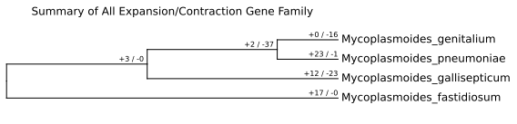
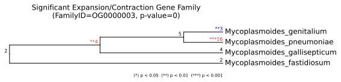
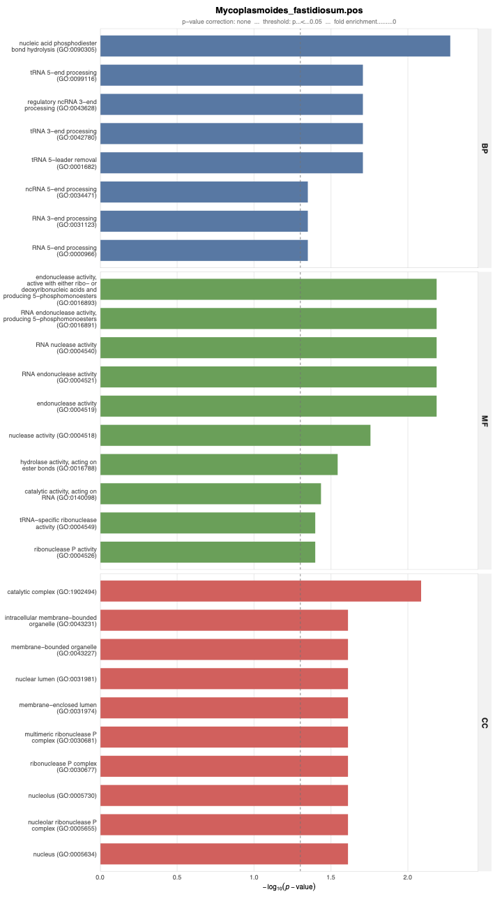
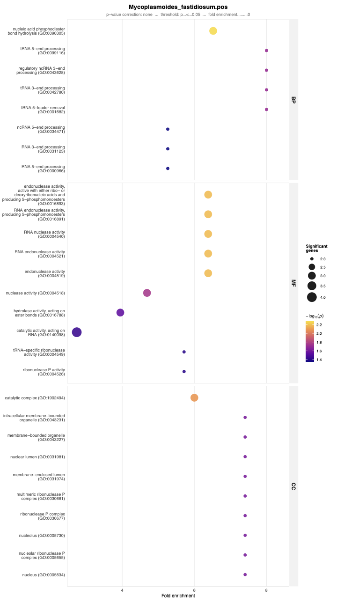

# EXCON Output Guide

This page describes the key outputs produced by the EXCON pipeline, with example figures from a test run on four *Mycoplasmoides* bacterial species.

To replicate this you run:

`nextflow run main.nf -profile docker,test_bacteria,mac -bg --orthofinder_v2 --predownloaded_gofiles data/mycoplasma_go_files -resume`

---

## Output Directory Structure

```
results/
├── cafe/                    # CAFE5 model fitting and selection
├── cafe_plot/               # Expansion/contraction visualisations
├── cafe_go/                 # GO enrichment results and plots
├── chromo_go/               # [optional] GO enrichment by chromosome (!won't work for mycoplasma!, only one chr)
├── eggnogmapper/            # [optional] EggNOG GO annotations
├── orthofinder_cafe/        # OrthoFinder species tree and orthogroups
├── species_tree/            # [optional, --iqtree_species_tree] IQ-TREE2 species tree
├── busco/                   # [optional, --stats] BUSCO completeness
├── agat/                    # [optional, --stats] Annotation statistics
├── quast/                   # [optional, --stats] Assembly statistics
└── pipeline_info/           # Execution reports, DAG, software versions
```

---

## CAFE Expansion/Contraction Plots (`results/cafe_plot/`)

All tree figures are published in PDF and SVG formats. SVG files are suitable for editing in Inkscape.

### Summary Tree (cafeplotter)

Produced by [CAFEPlotter](https://github.com/moshi4/CafePlotter) from the best-fitting CAFE5 model. Shows the **total** number of expanded (+) and contracted (−) gene families per branch, **without a p-value filter**.



*Example: four* Mycoplasmoides *species. Numbers on each branch show all expanded/contracted gene family counts. Internal nodes represent ancestral lineages.*

---

### Significant HOG Tree (`cafe_sig_hog_tree.pdf/svg`)

Same layout as the cafeplotter summary tree but restricted to **statistically significant** gene families only (branch p ≤ 0.05). Each leaf and internal node is annotated with `+expanded / −contracted` counts from `CAFE_summary.txt`. This is the figure to use when reporting how many families changed significantly on each lineage.

---

### Significant Gene Tree (`cafe_sig_gene_tree.pdf/svg`)

Shows the **net number of genes** gained or lost on each branch, summed across the significant families only. A family that contracted from 10 to 7 genes contributes −3, regardless of how many other genes it still contains. Use this figure to compare the magnitude of gene gain/loss, not just family counts.

> Note: both alternative tree figures are produced only when GO enrichment analysis is run (they depend on `CAFE_summary.txt` generated during that step).

---

### Node Number Guide (`cafe_node_label_guide.pdf/svg`)

Maps the internal node numbers used in `CAFE_summary.txt` (e.g. node 14, 15) to their positions on the species tree. Useful for interpreting which ancestral lineage a node refers to.

---

### Individual Gene Family Trees

For each significantly evolving orthogroup, a tree shows the gene count at each node with colour-coded significance: red = expansion, blue = contraction. Asterisks indicate significance level (* p<0.05, ** p<0.01, *** p<0.001).



*Example: OG0000003 — massive expansion in* M. pneumoniae *(+16 genes, ***) and contraction in* M. genitalium *(−3 genes, **), consistent with genome size differences in this clade.*

---

## GO Enrichment Plots (`results/cafe_go/`)

GO enrichment is run per species per direction (expanded/contracted gene families). Two publication-quality plot types are produced for each.

### Bar Plot

Terms are grouped by ontology (CC / MF / BP), sorted by significance, and coloured by category. Full GO term names are retrieved from `GO.db` — topGO's internal truncation is bypassed. The GO ID is shown below each term.



*Example: expanded gene families in* Mycoplasmoides fastidiosum. *X-axis: −log₁₀(p-value). Colour: ontology (blue = CC, green = MF, red = BP). Dashed line: significance threshold.*

---

### Dot Plot

The dot plot adds two extra dimensions: dot **size** encodes the number of significantly expanded/contracted genes annotated to that term, and dot **colour** (plasma gradient) encodes −log₁₀(p-value). X-axis shows fold enrichment, making it easy to distinguish highly significant but modestly enriched terms from strongly enriched terms with fewer genes.



*Example: expanded gene families in* Mycoplasmoides fastidiosum. *X-axis: fold enrichment. Dot size: significant gene count. Dot colour: −log₁₀(p-value), yellow (less significant) → purple (more significant).*

---

### Output Files

| File | Description |
|------|-------------|
| `*_TopGo_results_ALL.tab` | Raw topGO results table with all p-value corrections and fold enrichment |
| `TopGO_barplot_*.pdf` | Horizontal bar chart (ggplot2) |
| `TopGO_dotplot_*.pdf` | Dot plot with fold enrichment and gene count (ggplot2) |
| `TopGO_Pval_barplot_*.pdf` | Legacy bar chart (base R, retained for compatibility) |

---

## CAFE Summary Table (`results/cafe_go/.../CAFE_summary.txt`)

A tab-separated table with one row per species (leaf) and per internal node, produced during the GO enrichment step. The file is self-documenting — the first lines are comment lines (`#`) that define each column.

| Column | Description |
|--------|-------------|
| `Species/Node` | Leaf species name or ancestral node number (matches `cafe_node_label_guide.pdf`) |
| `Total_HOGs_significant` | Gene families with a significant branch p-value (p ≤ 0.05) |
| `Expansion_HOGs_significant` | Significant families with a net positive size change |
| `Contraction_HOGs_significant` | Significant families with a net negative size change |
| `Expansion_genes_significant` | Sum of gene count increases across all significant expanding families |
| `Contraction_genes_significant` | Sum of gene count decreases across all significant contracting families (reported as negative) |
| `Expansion_HOGs_total` | All families with any positive size change, regardless of significance |
| `Contraction_HOGs_total` | All families with any negative size change, regardless of significance |

> The `*_total` columns match what cafeplotter displays on the standard summary tree. The `*_significant` columns are what the alternative tree figures (`cafe_sig_hog_tree`, `cafe_sig_gene_tree`) use.

---

## CAFE Model Selection (`results/cafe/model_comparison/`)

| File | Description |
|------|-------------|
| `cafe_model_comparison.tsv` | AIC scores for k=1 through k=N rate categories |
| `best_model.txt` | Selected model: `uniform` or `poisson` at best k |

---

## IQ-TREE2 Species Tree (`results/species_tree/`)

Produced only when `--iqtree_species_tree` is set. The species tree passed to CAFE5 is then
this tree rather than the OrthoFinder one in `results/orthofinder_cafe/`.

| File | Description |
|------|-------------|
| `SpeciesTree_rooted.nwk` | The rooted tree actually used for CAFE5 |
| `iqtree/species_tree.treefile` | Unrooted ML tree, with SH-aLRT and ultrafast bootstrap support at each node |
| `iqtree/species_tree.iqtree` | Full IQ-TREE2 report, including the substitution model selected for each partition |
| `iqtree/species_tree.log` | IQ-TREE2 run log |
| `supermatrix/supermatrix.faa` | Concatenated single-copy orthogroup alignment, one sequence per species |
| `supermatrix/partitions.txt` | Partition boundaries in the supermatrix, one per orthogroup |

With `--tree_calibrations`, the same directory also holds the time-calibrated tree:

| File | Description |
|------|-------------|
| `SpeciesTree_dated.nwk` | Ultrametric tree with branch lengths in millions of years — the tree CAFE5 receives |
| `dating_calibrations.tsv` | Each calibration, the node it resolved to, and the age actually fitted |
| `dating_qc.tsv` | Model settings, root age, shortest branch, ultrametric/binary checks |

When this tree is used, CAFE5's λ is a rate per million years. Without it, λ is in units of the
(rescaled) substitution tree and is not comparable to published per-Myr rates.

Support values are given as `SH-aLRT/UFboot`. As a rule of thumb a branch is well supported when
SH-aLRT ≥ 80 and UFboot ≥ 95; treat anything below that as unresolved rather than as evidence for
the displayed topology.

Check the `CONCAT_SINGLE_COPY` log (or the task's `.command.out`) for how many orthogroups made it
into the supermatrix. Only orthogroups present exactly once in every species are used, so the
count can fall sharply as species are added or if any annotation is fragmented.

---

## Pipeline Metadata (`results/pipeline_info/`)

| File | Description |
|------|-------------|
| `execution_report_*.html` | Per-process resource usage summary |
| `execution_timeline_*.html` | Gantt-style timeline of all tasks |
| `execution_trace_*.txt` | Raw per-task CPU/memory/time trace |
| `pipeline_dag_*.html` | Interactive pipeline DAG |
| `software_versions.yml` | Exact versions of all tools used (cite from here) |
